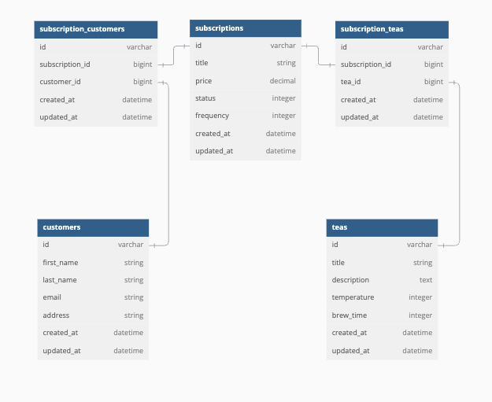

<h1> Tea Subscription 🫖 </h1>

This Tea Subscription is a Rails API that manages subscriptions, teas, and customers. The back-end includes key features such as:
	•	Subscription Endpoints: View all subscriptions, get details of specific subscriptions, and cancel subscriptions while preserving records.
	•	Active Record Models: Manages relationships between Subscriptions, Teas, and Customers.
	•	Seeding & Testing: Includes seeded data for testing and RSpec tests for API endpoints.

The back-end is built to be scalable, secure, and ready for future enhancements.

[GitHub Project board](https://github.com/users/jimmacur/projects/12)

[Figma Planning project board](https://www.figma.com/board/52FUFMkcAHFmeJ2qYQCtzJ/Take-Home-final-mod-3?node-id=0-1&node-type=canvas&t=3rete0JI4XdkUFN2-0)

<h2> Context </h2>

This Tea Subscription Service project was completed as a simulated take-home technical challenge, with a focus on both Frontend (FE) and Backend (BE) development. The project was designed to be completed within a 2-day timeframe, with approximately 8 hours dedicated to the front-end and 8 hours dedicated to the back-end.

The challenge aims to test skills in API development, model relationships, and user interaction, with an emphasis on building a functional and scalable service while managing time effectively.

<h2> Tech </h2>

BE - Ruby on Rails, tested with RSpec, simplecov

FE - Built with React and tested with Cypress

<h2> Installation </h2>

1. Fork and clone this BE repo 
[Tea Subscription BE repo](https://github.com/jimmacur/tea-subscription-BE)
2. `cd` into the repo
2. Run these commands in your terminal
  - `bundle install`
  -  `rails db:{drop, create, migrate, seed}`
  -  `rails s`

4. Fork this FE repo
[Tea Subscription FE repo]()
5. `cd` into cloned repo
6. Run `npm install`
7. Run `npm start`
8.  Enter `control + c` in your terminal to stop running the React app at any time
9. To run Cypress tests, use `npx cypress open`

<h2> Contributors </h2>

Jim Macur - [linkedin](https://www.linkedin.com/in/jimmacur/) - [gitHub](https://github.com/jimmacur) - jim.macur@gmail.com 

<h2> Learning Goals </h2>

	•	Project Planning and Time Management: Manage and deliver both a front-end and back-end application within a short 2-day timeframe, simulating a real-world technical challenge.

	•	Backend API Development: Design and implement a Rails API that supports essential CRUD operations, with a focus on creating endpoints for subscription management, tea data, and customer interactions.

	•	Database Design and Relationships: Build and optimize relational databases using Active Record to manage complex relationships between Subscriptions, Teas, and Customers.

	•	RESTful API Architecture: Develop clean and well-documented RESTful API endpoints that follow best practices for resource management and error handling.

	•	Testing and Test-Driven Development (TDD): Write unit and integration tests using RSpec to ensure backend functionality is working as expected, with a focus on achieving high test coverage.

	•	Time-Efficient Development: Prioritize tasks and develop both front-end and back-end features efficiently within a limited time frame, simulating the pressure of a take-home technical challenge.

	•	Professional Development: Gain experience simulating a real-world software development process by completing a full-stack project in a short period, handling both individual responsibilities and project management.

	•	Version Control and Collaboration: Use Git for version control, applying branching strategies, committing often, and following best practices in code collaboration.